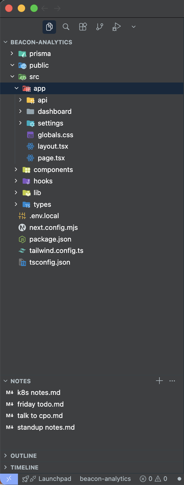
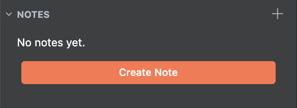
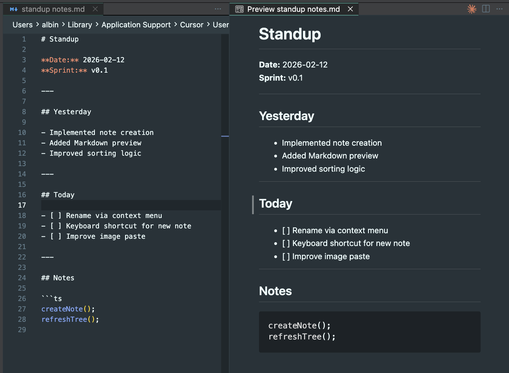
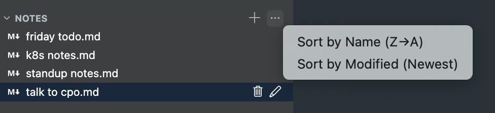
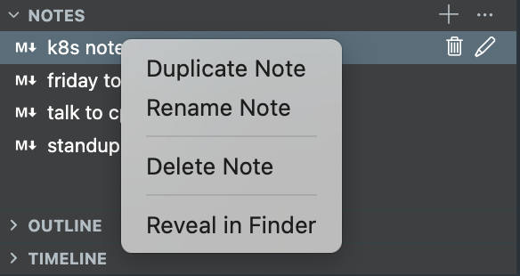

# Explorer Notes

A quick notepad right in the Explorer sidebar — always one click away, no matter what project you're in.




## Features

- **Markdown notes** in the Explorer sidebar with live preview
- **Quick Pick search** to find and open notes from the command palette
- **Sorting** by name or modified date via the `...` menu
- **Right-click context menu** to rename, delete, duplicate, or reveal notes in Finder
- **Image paste** — copy an image and paste it directly into a note
- **Global storage** — notes live in VS Code's global storage, shared across all workspaces

## Getting Started

Open the **Notes** section at the bottom of the Explorer sidebar. If you have no notes yet, click **Create Note** to get started.



## Editing Notes

Click any note to open it in the editor. Use the built-in Markdown preview for a side-by-side editing experience.



## Sorting

Sort notes by name or modified date from the `...` menu. The sort option toggles direction — click again to reverse.



## Context Menu

Right-click any note to rename, delete, duplicate, or reveal it in Finder. Inline icons for delete and rename are also available on hover.



## Commands

| Command | Description |
|---------|-------------|
| `Notes: Create Note` | Create a new Markdown note |
| `Notes: Open Note` | Quick Pick search to open a note |

All other actions (rename, delete, duplicate, reveal, sort) are available via the sidebar UI.

## Storage

Notes are stored as `.md` files in VS Code's global extension storage:

```
~/Library/Application Support/Cursor/User/globalStorage/albinbackstrom.explorer-notes/
```

Notes are shared across all workspaces and windows, and don't pollute your project folders.


## License

[MIT](LICENSE)
